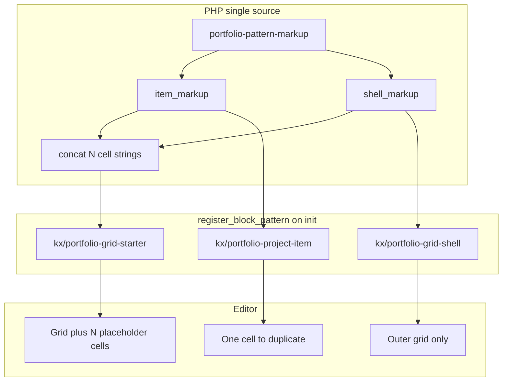

# Portfolio-Grid (Gutenberg) im Stitch-Layout – Umsetzungsplan

## Ausgangslage

- Die Section ist **kein** Shortcode-basiertes Post-Grid, sondern ein **Group-Block mit Grid-Layout**, äußeres Markup u. a. mit Hilfsklasse `c-gap-5` (Spaltenabstand).
- Innen: je Zelle eine **Group (constrained)** mit Bild, Überschrift (z. B. `p` mit Heading-Klasse), Fließtext.
- **Entscheidung:** KX-Fonts unverändert; nur **Layout, Abstände, Flächen, Radien, Hover** an das Stitch-„Architectural Curator“-System anlehnen (keine Stitch-Webfonts).
- **Entscheidung:** Ansprache über **Block-Pattern** mit stabilen Klassen: äußere Group **`kx-portfolio-grid`**, innere Zellen **`kx-portfolio-cell`**. Bestehende Seiten können dieselben Klassen manuell setzen.

## Architektur: modular und wartbar

**Problem mit einem monolithischen statischen Theme-Pattern-Datei:** WordPress liest solche Dateien nach dem Header als **statischen** Markup-Text — keine saubere Wiederverwendung einer „Zelle“ über mehrere Patterns hinweg.

**Lösung:** Wiederholendes Markup liegt in **PHP-Funktionen** (eine Quelle der Wahrheit). Registrierung per **`register_block_pattern()`** auf `init`.

### Modul-Schnitt

| Baustein | Slug (Vorschlag) | Zweck |
| -------- | ---------------- | ----- |
| Shell | `kx/portfolio-grid-shell` | Nur äußere Group: `kx-portfolio-grid`, Grid-Layout, `c-gap-5`, ggf. minimaler Platzhalter. Redakteure fügen **mehrfach** Pattern „Projekt-Zelle“ ein oder duplizieren Zellen. |
| Item | `kx/portfolio-project-item` | **Eine** innere Group mit `kx-portfolio-cell` + Image + Überschrift + Text. Skalierung durch Einfügen/Duplizieren. |
| Starter | `kx/portfolio-grid-starter` | Shell + **N** Zellen durch Konkatenation derselben Item-Markup-Funktion (z. B. N=3). Änderungen an der Zelle wirken auf den Starter automatisch. |

### Dateien (Vorschlag)

- **Markup-Modul** — nur String-Builder für serialisierte Blöcke (keine Hooks). Konstanten für wiederkehrende Block-Attribute (Grid-Spalten, Abstände, Bildgröße).
- **Registrierungs-Modul** — `init`-Hook mit drei `register_block_pattern()`-Aufrufen; Beschreibungen für Redakteure (Shell zuerst, dann Items, oder Starter).
- **Einbindung** — per `require_once` aus Theme-Setup oder bestehender Gutenberg-Zentrale.

### Wartbarkeit / Skalierung

- **Strukturänderung der Zelle:** nur Item-Markup-Funktion anfassen — Shell und Starter bleiben stabil.
- **Raster-Defaults ändern:** nur Shell-Markup / Konstante im Markup-Modul.
- **Mehr Start-Zellen:** Konstante oder WordPress-Filter auf Zellenanzahl, ohne Markup zu duplizieren.
- **Kein** paralleles statisches Pattern-Verzeichnis für dieselbe Logik — vermeidet Divergenz.

### Migration bestehender Seite

- Äußere Group: Klasse `kx-portfolio-grid`.
- Jede innere Projekt-Group: Klasse `kx-portfolio-cell` (oder Items durch Pattern „Projekt-Zelle“ ersetzen).

*Optional:* Statische Theme-Pattern-Datei nur für Discoverability — nicht empfohlen, weil manuell synchron zu halten.

## SCSS: Stitch-inspiriertes Layout, KX-Tokens

- Neue Komponenten-Stylesheet-Datei für Portfolio-Grid.
- Import über bestehende **Block-Komponenten**-Pipeline, damit der **Block-Editor** dieselben Regeln lädt wie das Frontend (Editor-Styles importieren Block-Komponenten, nicht alle Seiten-Komponenten).

**Selektoren (Vorschlag):**

- Root: `.kx-portfolio-grid.is-layout-grid` (ggf. Fallback ohne `.is-layout-grid`).
- **Raster:** `row-gap` explizit (`c-gap-5` regelt nur Spaltenabstand); Abstände im Pattern mit Editor abgleichen.
- **Zellen:** `.kx-portfolio-grid > .wp-block-group.kx-portfolio-cell` als „Karte“ — keine Styles auf jede beliebige constrained Group im Grid. Flächen statt harter 1px-Ränder (Stitch „No-Line“).
- **Bild:** abgerundete Ecken, `overflow: hidden`, `object-fit: cover`; kompatibel mit bestehender quadratischer Bild-Klassifizierung.
- **Typo:** nur Abstände, keine `font-family`-Wechsel.
- **Hover / Fokus:** dezente Schatten oder leichte Flächenänderung; `prefers-reduced-motion` beachten.
- **Optional:** leichte `:nth-child`-Asymmetrie nur wenn mobil unkritisch.

## Build & Verifikation

- Theme-Build für SCSS ausführen; kompilierte Frontend- und Editor-Styles aktualisieren.
- **Checks:** Frontend (Landing), Block-Editor — Grid, Umbrüche, Touch, Fokus.

## Dokumentation

- Bei Bedarf STATUS und ARCHITECTURE um Pattern-Slugs und CSS-Klassen ergänzen.

## Risiken / Abgrenzung

- **Floating Tags / Chips** aus Stitch ohne zusätzliche Blöcke nicht abbildbar — out of scope.
- Pattern ersetzt nicht automatisch die Live-Seite; **einmalige** Editor-Anpassung nötig.
